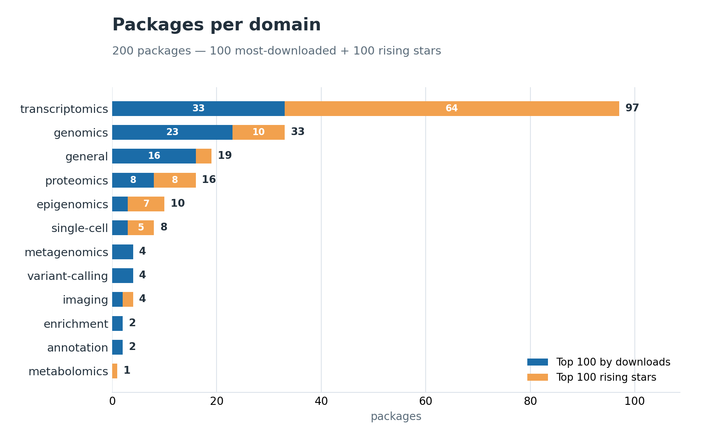
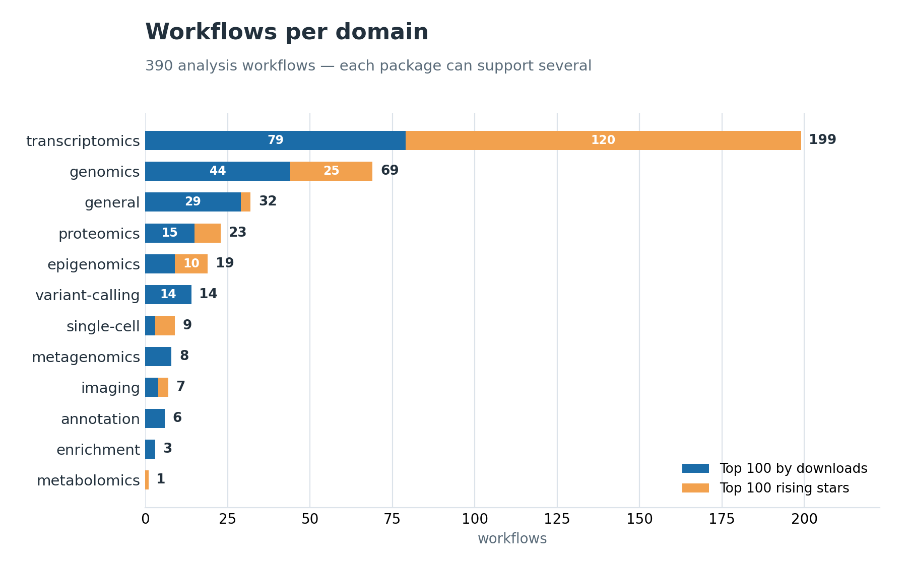

# BioMate-KB — Bioconductor Skills

**200 Bioconductor packages — the top 100 most-downloaded plus the top 100 rising stars — formatted as Claude Code Skills.**

A skill bundle in [Claude Code Skills](https://docs.anthropic.com/en/docs/claude-code/skills-overview) format. It covers the 100 most-used Bioconductor packages **and** the top 100 rising-star packages (newly released since ~2021 and fast-growing) from the BioMate-KB knowledge base. Each skill teaches Claude when to choose a package, **the workflows it supports** (each analysis as a recipe), what parameters to set, how to interpret results, and what pitfalls to avoid.

## What's here

```
skills/  (200 packages · 12 domains)                  ⭐ = rising star
├── transcriptomics/  (97 — DESeq2, edgeR, limma  ·  ⭐ crisprScore, BUSseq, ASURAT)
├── genomics/         (33 — GenomicRanges, Biostrings  ·  ⭐ doubletrouble, cogeqc, ggmanh)
├── general/          (19 — Biobase, DOSE  ·  ⭐ faers, immunotation, mosbi)
├── proteomics/       (16 — MSnbase, mixOmics, mzR  ·  ⭐ bandle, MatrixQCvis)
├── epigenomics/      (10 — ChIPseeker, minfi  ·  ⭐ HiCExperiment, HiContacts, epigraHMM)
├── single-cell/      (8  — SingleCellExperiment  ·  ⭐ demuxmix, hoodscanR, MuData)
├── variant-calling/  (4  — VariantAnnotation, snpStats, vsn)
├── metagenomics/     (4  — phyloseq, microbiome, DirichletMultinomial)
├── imaging/          (4  — flowCore, EBImage  ·  ⭐ cytoviewer, lisaClust)
├── annotation/       (2  — biomaRt, KEGGgraph)
├── enrichment/       (2  — enrichplot, ReactomePA)
└── metabolomics/     (1  — ⭐ rgoslin)
```

A package that supports multiple analyses lists each as a `### ` recipe under a **`## Workflows`** section (e.g. DESeq2 → standard / multi-factor / LRT; crisprscore → on-target / off-target / indel scoring). The most-used 100 account for ~60% of all Bioconductor downloads; the rising-star 100 surface newly-important packages before they hit the top by volume. The full BioMate KB covers all 1,818 active Bioconductor packages, available via [BioMate Cloud](https://biomate.ai).

**Bioconductor version:** these skills are grounded against **Bioconductor 3.21** (pinned explicitly — `release` is a moving pointer that drops packages as it advances, e.g. several rising stars dropped out of 3.23). The pinned version is recorded in `MANIFEST.json` (`bioconductor_version`); re-fetch a different snapshot with `BIOC_VERSION=… python3 extraction/fetch_authoritative_sources.py`.

## Full package list

All **200 packages** — with category, description, and the workflows each one supports — are in
**[PACKAGES.md](PACKAGES.md)** (one page, four columns; ⭐ marks rising stars).

### Packages per domain



### Workflows per domain

A package with multiple analyses contributes one `### ` recipe subsection per workflow — **390 workflows
across the 200 packages; 89 are multi-workflow** (e.g. DESeq2 → DE / multi-factor / QC-transform /
LRT; crisprScore → 6 scoring recipes).



## How these 200 were selected

Two ranked sets of 100:

- **Top 100 by downloads** — ranked purely by the official Bioconductor download score
  (`bioc_pkg_scores.tab`). These ≈ **60% of all Bioconductor download traffic**. Because the rank
  is by raw volume, this set includes both **analysis tools** (DESeq2, edgeR, limma, fgsea, …) and
  the **foundational data-structure / I/O / annotation** packages nearly every analysis imports
  (GenomicRanges, Biostrings, SingleCellExperiment, AnnotationHub, …).
- **Top 100 rising stars** — restricted to **analysis** packages (infrastructure, data-container,
  and GUI packages excluded), recently released (first release ≥ 2021) and fast-growing in 2025
  (year-over-year download growth + ≥ 3,000 distinct download IPs), ranked by 2025 downloads. They
  surface newly-important methods *before* they reach the top by raw volume.

Together: 200 of the ~3,058 ranked Bioconductor software packages (~6.5% by count), spanning the
highest-traffic and fastest-emerging methods. The full BioMate KB indexes all 1,818 active packages.

> **Note on domains.** Domain labels come from BioMate's catalog and are intentionally coarse —
> *transcriptomics* is a broad bucket that also absorbs many single-cell, spatial, and gene-set
> tools (e.g. scater/scran are single-cell; fgsea/GSVA are enrichment), which is why it dominates
> the charts.


## Want the full collection?

This bundle covers 200 Bioconductor packages (top 100 by downloads + 100 rising stars). **[BioMate AI](https://www.biomate.ai)** gives you:

- **Full coverage** — all 1,818+ active Bioconductor packages plus 2,455 curated workflows across genomics, transcriptomics, proteomics, drug discovery, and more
- **Efficient parallel computing** — workflows run in the cloud with automatic scaling, no cluster setup required
- **Output visualization and analysis** — interactive charts, QC dashboards, and AI-generated findings built in
- **Report generation** — one-click publication-ready methods reports and summary documents

**Start using BioMate AI for free at [www.biomate.ai](https://www.biomate.ai)**
Questions or collaboration inquiries: [contact@biomate.ai](mailto:contact@biomate.ai)

## How to use

```bash
# Clone
git clone https://github.com/bioMate-AI/biomate-bioconductor-kb.git
cd biomate-bioconductor-kb

# Install all skills into Claude Code (global)
find skills -name "SKILL.md" | while read f; do
  pkg=$(dirname "$f" | xargs basename)
  cp "$f" ~/.claude/skills/bioconductor-${pkg}.md
done
```

Or copy a single domain:

```bash
# Only RNA-seq DE skills
find skills/transcriptomics -name "SKILL.md" | while read f; do
  pkg=$(dirname "$f" | xargs basename)
  cp "$f" ~/.claude/skills/bioconductor-${pkg}.md
done
```

Each `SKILL.md` is a self-contained Claude Code skill file — Claude discovers it automatically once it's in `~/.claude/skills/` (global) or `.claude/skills/` (project-level).

## Ranking source

Packages are ordered by Bioconductor's official monthly download score:
- Source: <https://bioconductor.org/packages/stats/bioc/bioc_pkg_scores.tab>
- Snapshot taken: 2026-05-21
- Top 100 by download of 3,058 ranked software packages (~60% of download traffic) + 100 analysis rising stars = 200 (~6.5% of the catalog by count)

Because the ranking is by download volume, the bundle includes both **analysis tools** (DESeq2, edgeR, limma, fgsea, …) and the **core data-structure, I/O, and annotation packages** that nearly every analysis depends on (GenomicRanges, Biostrings, SingleCellExperiment, AnnotationHub, …) — the latter rank highly precisely because they are imported everywhere. Both are useful to an agent: the analysis packages teach *how to analyze*, the foundational ones *how to represent and load* the data.

## Knowledge layer, not pipelines

These skills are the **knowledge layer** — when and why to use each package, with parameters, assumptions, pitfalls, and alternatives. They are not runnable pipelines and carry no infrastructure details.

**BioMate hosts and executes these workflows for you** — managed compute, automated QC, and reproducible outputs — powered by this same Bioconductor know-how. For end-to-end cloud execution, see **[BioMate](https://www.biomate.ai)**.

## License

- **Skill content** (`skills/**/*.md`, `MANIFEST.json`): **CC-BY-4.0** — share + adapt with attribution.
- **Extraction scripts** (`extraction/*.py`): **Apache-2.0** — use, modify, distribute.
- **Underlying Bioconductor packages** retain their own (mostly Artistic-2.0 / GPL) licenses.

## Citation

If you use this skill bundle in research, please cite:

> Zhang, Y. (2026). *BioMate-KB: A Real-Execution-Validated Workflow Knowledge Base for Bioconductor* (3.0). Zenodo. https://doi.org/10.5281/zenodo.20616356

And, for the execution-grounding methodology:

> Zhang, Y. (2026). *Structure Grounding Is Not Enough: Real Execution as the Ground Truth for LLM-Generated Bioinformatics Workflows* (Version v3). Zenodo. https://doi.org/10.5281/zenodo.20616544

Concept DOIs (always resolve to the latest version): BioMate-KB — https://doi.org/10.5281/zenodo.20616355 · Structure Grounding — https://doi.org/10.5281/zenodo.20616543

## Regenerating the bundle

```bash
# Re-fetch the latest Bioconductor download scores
curl -O https://bioconductor.org/packages/stats/bioc/bioc_pkg_scores.tab

# Regenerate the download-ranked set (top 100 by default).
# The 100 rising-star skills are a separately-curated set (analysis packages,
# first release >= 2021, ranked by 2025 download growth) generated per-package
# via extract_skill.py, then vignette-grounded with enrich_v2_grounded.py.
python3 extraction/generate_bundle.py --top 100

# Single package
python3 extraction/extract_skill.py \\
    --db <path-to-biomate-knowledge-db> \\
    --pkg DESeq2 \\
    --out my-deseq2-skill.md
```

The extraction code (`extraction/extract_skill.py`) is intentionally minimal (~300 lines) and reads only from BioMate's public knowledge fields — `tool_knowledge.{use_cases, limitations, alternatives, recommended_parameters, primary_citation, benchmark_papers}` and `tools.scientific_context`. Internal and infrastructure fields are excluded.

## Versioning

This is **v1.0.0** of the bundle. Future versions will track:
- New Bioconductor releases (currently pinned to 3.20)
- Expanded coverage (top-1000 if community demand justifies)
- Refined SKILL.md sections (Q&A, gotchas, additional examples)

## Contributing

Open an issue or PR for:
- Errors in any SKILL.md
- Suggestions for new sections to extract
- Packages missing from the top-100 / rising-star sets that should be included

## Acknowledgments

Bioconductor download statistics published by the Bioconductor Core Team. SKILL.md format from [Anthropic Claude Code](https://docs.anthropic.com/en/docs/claude-code/skills-overview).
